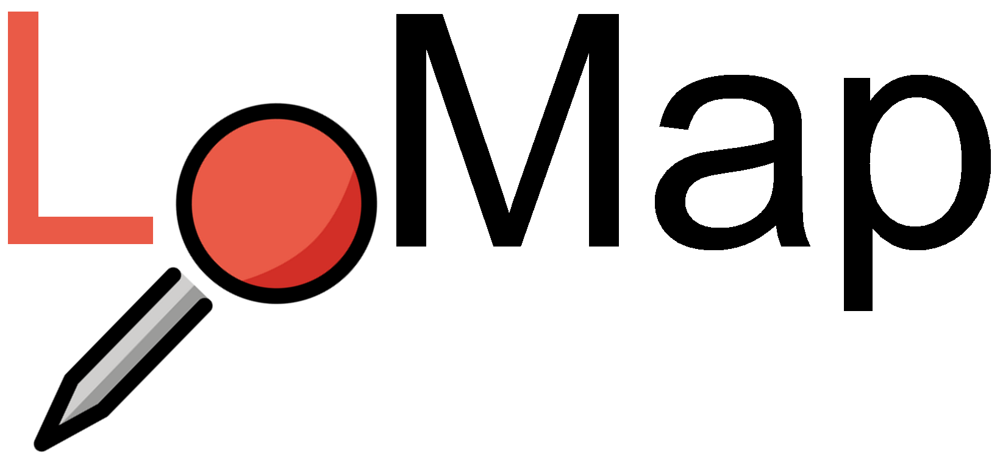

# LoMap es1c

## What is LoMap
LoMap is an application developed for a school project that let's you create your own personalized maps with the place that you are interested in.

### Main Features:
   - You can add your own markers to the map with some customization such as the name or the category.
   - The markers are shown in the map and can be filtered with some options.
   - You can add photos, comments and rating to all of your locations.

## Automatic Code Analysis
To ensure that the code is running as we expect and also that the quality of it is above our standards we use some pages that analyses our code
automatically.

## The Team

The group is composed of four members that are the following

### Group members:
|Developers | Emails |
|---------|------|
| David González Fernández | uo276818@uniovi.es |
| Miguel Suárez Artime | uo271497@uniovi.es |
| Damián Fernández Álvarez | uo283970@uniovi.es |
| Rubén Caño Domínguez  | uo284647@uniovi.es |

## Technologies 

We use different technologies for the develop of the application. For the front part of the application we use **React** with **JavaScript**, for the backend we have an API developed in **NodeJS** and for the storage of the data we use **SOLID PODs**.

